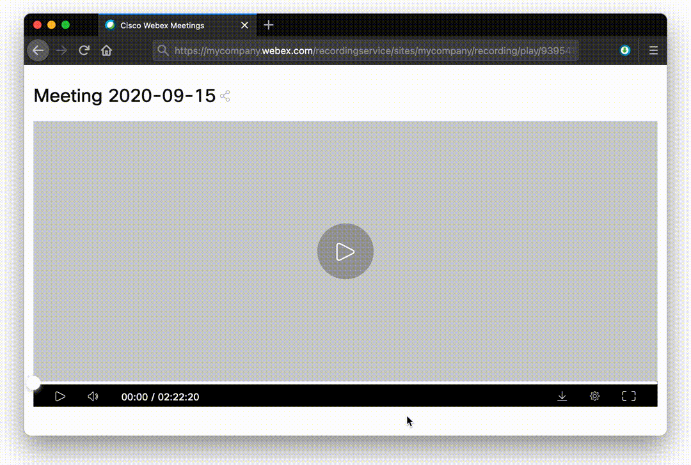

*Leggi in altre lingue: [English](README.md), [Italiano](README.it.md).*

# WebXDownloader

Questa è un'estensione del browser per scaricare le registrazioni delle riunioni Webex. Aggiunge un pulsante ai controlli di riproduzione video consentendo il download della registrazione in formato mp4. Fornisce inoltre l'URL del flusso HSL e consente di salvare la trascrizione della chat in formato JSON o testo txt.

## Installazione

### Firefox (consigliato)

Scarica il file `.xpi` dall'[ultima versione] (https://github.com/jacopo-j/WebXDownloader/releases) e trascinalo in qualsiasi finestra di Firefox per installarlo.

### Google Chrome

* Scarica il file `.zip` dall'[ultima versione] (https://github.com/jacopo-j/WebXDownloader/releases)
* Estrai il file zip
* Vai a `chrome: // extensions`
* Attiva la "Modalità sviluppatore" in alto a destra
* Fai clic su "Carica estensione non pacchettizzata..." in alto a sinistra
* Seleziona la cartella in cui è stato estratto il file zip.

### Safari (sperimentale)

1. Scarica il file `.dmg` dall'[ultima versione] (https://github.com/jacopo-j/WebXDownloader/releases)
2. Montare l'immagine del disco facendo doppio clic su di essa
3. Trascina l'app WebXDownloader nella cartella Applicazioni
4. Apri l'app una volta (fai clic con il tasto destro> apri)
5. Apri Safari> Preferenze> Estensioni e abilita WebXDownloader

## Utilizzo

Basta andare alla pagina della registrazione della riunione e si troverà un pulsante di download sul lato destro della barra di controllo della riproduzione. Per copiare l'URL dello stream HLS o scaricare la trascrizione della chat, avviare l'estensione dal browser.
